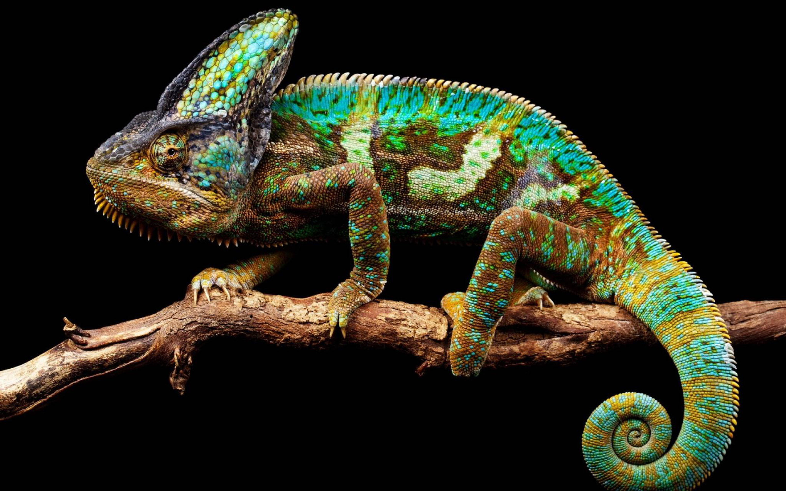

<!DOCTYPE html>
<html lang="en">
<head>
<meta charset="UTF-8">
<title>How to Tell Wild Animals</title>

</head>

<body>

<!-- 🎵 Background Music -->
<audio autoplay loop>
    <source src="https://www.soundhelix.com/examples/mp3/SoundHelix-Song-1.mp3" type="audio/mpeg">
</audio>

<header>
    <h1>🐾 How to Tell Wild Animals</h1>
    <h3>By Carolyn Wells</h3>
</header>

<!-- Summary -->

    <h2>📖 Summary</h2>
    

        This poem humorously explains how to identify wild animals in dangerous situations.
        It uses irony and fun descriptions to make learning interesting.
    

<!-- Mindmap with Images -->

    <h2>🧠 Mind Map</h2>
    

        

            
            🦁 Lion Roars loudly
        

        

            
            🐯 Tiger Stripes & danger
        

        

            
            🐆 Leopard Spots & attack
        

        

            
            🐻 Bear Deadly hug
        

        

            
            🐊 Crocodile Tears
        

        

            
            😂 Hyena Laughs
        

        

            
            🦎 Chameleon Color change
        

    

<!-- Themes -->

    <h2>🎯 Themes</h2>
    <ul>
        <li>Humour in danger</li>
        <li>Irony</li>
        <li>Wildlife awareness</li>
    </ul>

<!-- Tone -->

    <h2>🎭 Tone</h2>
    <ul>
        <li>Humorous</li>
        <li>Playful</li>
        <li>Light-hearted</li>
    </ul>

<!-- Interactive -->

    <h2>✨ Fun Fact</h2>
    <button onclick="showFact()">Click Me</button>
    

        You identify animals only after they attack 😄 (funny but dangerous!)
    

</body>
</html>
